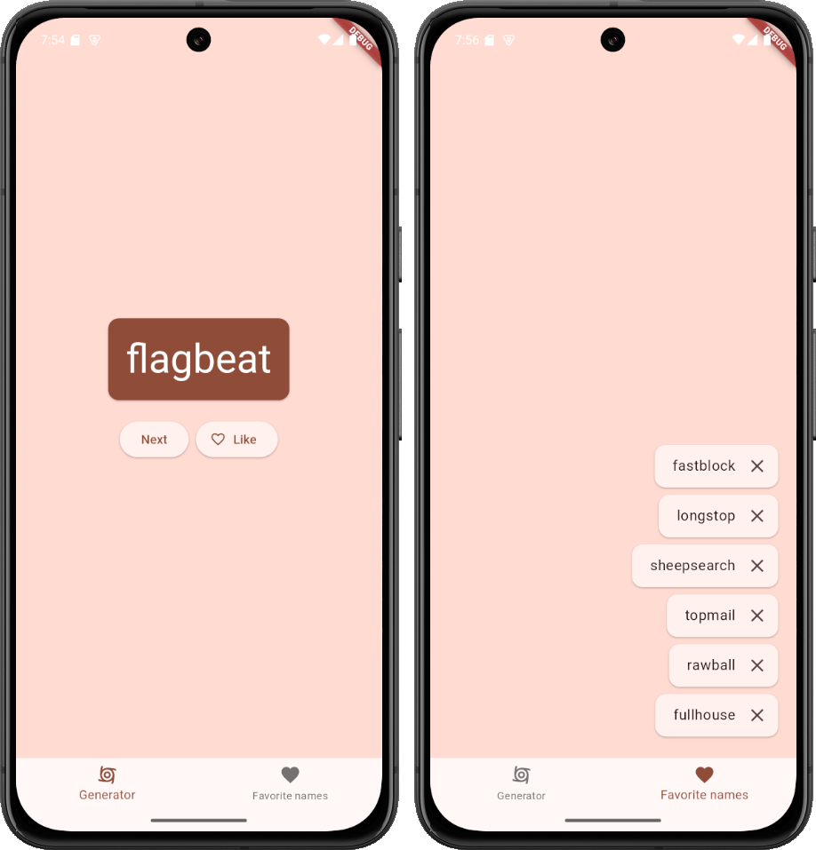

# Name generator on Flutter

Flutter project that generates random phrases (started from codelab https://codelabs.developers.google.com/codelabs/flutter-codelab-first)
But then upgraded with better responsive navigation, navigaton animations and permanent storage.

## Dependencies

- Flutter SDK 3.27
- [english_words package v4.0.0+](https://pub.dev/packages/english_words)
- [provider package v6.0.0+](https://pub.dev/packages/provider/)

## How to build

## Screenshots

